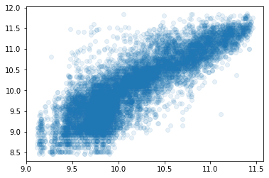
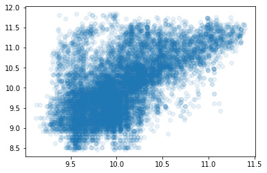

# Tree Ensemble
> A decision tree ensemble implementation (see: http://course18.fast.ai).


## Install

`pip install decision_tree` but ... if you're looking for a production ready tree ensemble/random forest, you really should use https://scikit-learn.org/ instead (o:

## How to use

Load data copied from the final model used in https://github.com/fastai/fastai/tree/master/courses/ml1/lesson2-rf_interpretation.ipynb

```python
bulldozers_data = np.load('test/data/bulldozers.npy', allow_pickle=True)
train_data = DataWrapper(*bulldozers_data[:4])
valid_data = DataWrapper(*bulldozers_data[4:])
train_data, valid_data
```


    (DataWrapper(x:['YearMade' 'Coupler_System' 'ProductSize' 'fiProductClassDesc' 'ModelID'
      'saleElapsed' 'fiSecondaryDesc' 'fiModelDesc' 'Enclosure'
      'fiModelDescriptor' 'Hydraulics_Flow' 'Drive_System' 'ProductGroup'
      'Track_Type' 'state' 'saleDay' 'ProductGroupDesc' 'age'] y:SalePrice, len:389125),
     DataWrapper(x:['YearMade' 'Coupler_System' 'ProductSize' 'fiProductClassDesc' 'ModelID'
      'saleElapsed' 'fiSecondaryDesc' 'fiModelDesc' 'Enclosure'
      'fiModelDescriptor' 'Hydraulics_Flow' 'Drive_System' 'ProductGroup'
      'Track_Type' 'state' 'saleDay' 'ProductGroupDesc' 'age'] y:SalePrice, len:12000))


I was hoping to do a run on all of this data - but it's too slow unless we use a sub-set

using prun while training a single DecisionTree tells us;
<pre>
18998653 function calls (18972487 primitive calls) in 18.418 seconds

   Ordered by: internal time
  
   ncalls  tottime  percall  cumtime  percall filename:lineno(function)
  8478750    5.034    0.000    5.034    0.000 core.py:28(upd)
   261670    4.998    0.000   17.480    0.000 models.py:23(best_split_for_col)
   645756    1.337    0.000    1.337    0.000 {method 'reduce' of 'numpy.ufunc' objects}
   915106    1.224    0.000    2.384    0.000 core.py:21(agg_std)
   915106    0.828    0.000    1.160    0.000 core.py:20(agg_var)
   261670    0.579    0.000    0.579    0.000 data.py:73(get_sample)
</pre>

This is too slow to be of any use - we need to be able to train with ~half a millon rows in ~30 seconds

| n_trees/sample_size | number of rows used in training | Wall time |
|---------------------|---------------------------------|-----------|
| 10/1500             | 1e4                             | 1.93 s    |
| 10/20%              | 4e4                             | 10.4 s    |
| 10/20%              | 1e5                             | 26.5 s    |
| 10/1500             | 4e4                             | 1.87 s    |

it takes ~3s to train a single tree on 10000 rows

```python
def time_fit(n_rows, sample_size=1500, n_trees=10):
    data = train_data.tail(int(n_rows))
    if sample_size<1: sample_size=int(n_rows*sample_size)
    m = TreeEnsemble(data, sample_size=sample_size, n_trees=n_trees, min_leaf_samples=5)
    %time m.fit()
    print('\n', m, '\n')
    test_preds = m.predict(valid_data.x)
    loss = rmse(test_preds, valid_data.y); print('loss', loss)
    plt.scatter(test_preds, valid_data.y, alpha=.1);
```

```python
time_fit(1e4, 750, n_trees=50)
```

    CPU times: user 125 ms, sys: 65.9 ms, total: 191 ms
    Wall time: 2.64 s
    
     tEnsemble(data=DataWrapper(x:['YearMade' 'Coupler_System' 'ProductSize' 'fiProductClassDesc' 'ModelID'
     'saleElapsed' 'fiSecondaryDesc' 'fiModelDesc' 'Enclosure'
     'fiModelDescriptor' 'Hydraulics_Flow' 'Drive_System' 'ProductGroup'
     'Track_Type' 'state' 'saleDay' 'ProductGroupDesc' 'age'] y:SalePrice, len:10000) n_trees=50 sample_size=750 max_depth=None min_leaf_samples=5) 
    
    loss 0.4262759962503293





```python
time_fit(3125, 750)
```

    CPU times: user 28.8 ms, sys: 50 ms, total: 78.8 ms
    Wall time: 585 ms
    
     tEnsemble(data=DataWrapper(x:['YearMade' 'Coupler_System' 'ProductSize' 'fiProductClassDesc' 'ModelID'
     'saleElapsed' 'fiSecondaryDesc' 'fiModelDesc' 'Enclosure'
     'fiModelDescriptor' 'Hydraulics_Flow' 'Drive_System' 'ProductGroup'
     'Track_Type' 'state' 'saleDay' 'ProductGroupDesc' 'age'] y:SalePrice, len:3125) n_trees=10 sample_size=750 max_depth=None min_leaf_samples=5) 
    
    loss 0.5752066377812673





# Tree Ensemble project set-up

You can create a `tree_ensemble` anaconda enviroment with the following;
<pre>
conda create -n tree_ensemble python=3.7 -y
conda activate tree_ensemble
pip install nbdev
pip install pandas
pip install matplotlib
</pre>
